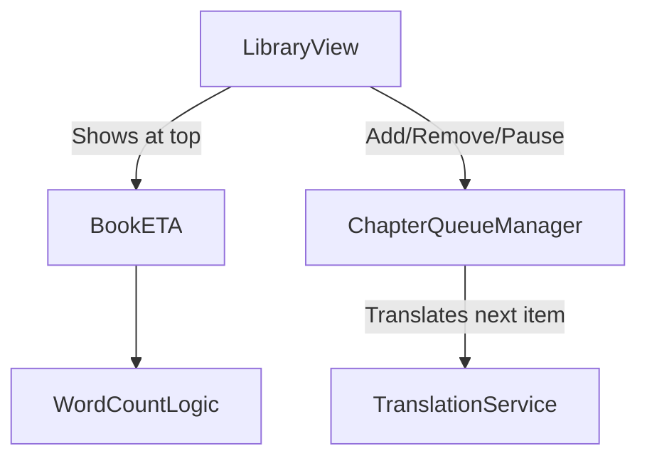

# System Design & Architecture

## Architecture Overview
**What is the high-level system structure?**

This feature touches two independent concepts: ETA Calculation and Queue Management.

## Data Models
**What data do we need to manage?**

- **Settings (`settings.json`):**
  - `local_llm_wpm` (Words per minute): Base speed for ETA calculation. (Default ~180).
- **Chapter Queue State (In-Memory per Book):**
  - `queued_chapter_ids`: List of chapter IDs waiting to be translated.
  - `status`: Idle, Running, Paused.

## API Design
**How do components communicate?**

- `TranslationQueueManager` needs methods:
  - `enqueue(chapter)`
  - `dequeue(chapter_id)`
  - `pause()`
  - `resume()`
- `LibraryView` needs methods:
  - `update_book_eta(book)`

## Component Breakdown
**What are the major building blocks?**

- **Library View UI (`library_view.py`):**
  - A new `CTkLabel` at the top header area (next to "Đọc Thử (Webview)") displaying the total book ETA.
  - UI controls for the Queue (e.g., a "Translate Queue" button, and status indicators per chapter).
- **ETA Utility:**
  - A function that iterates through all untranslated chapters of a book, sums the words, and divides by WPM.
- **Queue Manager:**
  - A background thread that safely iterates over `queued_chapter_ids` and calls the `TranslationService` for each.

## Design Decisions
**Why did we choose this approach?**

### Decision 1: Separation of Book ETA and Queue
- **Problem**: Users want to know the total cost of translating a book, but only want to actually execute translation on specific chapters.
- **Decision**: The ETA displayed at the top ALWAYS calculates the time for the *remaining untranslated parts of the entire book*, regardless of what is in the Queue. The Queue is just an execution mechanism.

## Non-Functional Requirements
**How should the system perform?**

- ETA calculation must be fast (caching total words if possible).
- Queue operations must be thread-safe to prevent CustomTkinter crashes.
